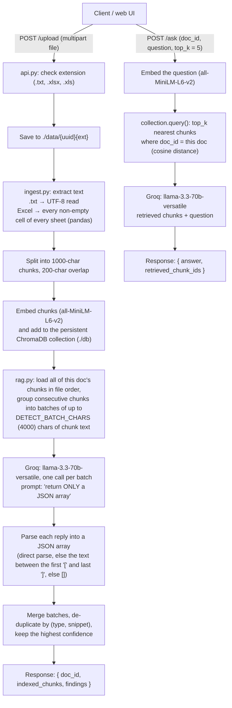

# RiskBot – HRCI / NPPI Detector

[](https://github.com/Kadaru242003/HRCI-NPPI-doc-finder/actions/workflows/tests.yml)

RiskBot is a small FastAPI service that uses an LLM (LLaMA-3.3-70B, served by [Groq](https://groq.com)) to flag
sensitive data in uploaded **.txt** and **Excel** files:

- **HRCI**: Human Resources Confidential Information, such as salaries, bonuses, performance reviews, PIPs,
  terminations and employment-related medical information.
- **NPPI**: Non-Public Personal Information, such as SSN-like numbers, bank or routing numbers, account or
  loan numbers and credit card numbers.

You upload a file and get back a JSON list of flagged text spans found anywhere in the file. A chat endpoint
then answers follow-up questions about the same document, such as "show only NPPI". It retrieves the chunks of
the document most similar to the question and gives only those to the LLM (retrieval-augmented generation).
A single-page web UI is included.

<p align="center">
  
  <br/><br/>
  
</p>

---

## How it works

The LLM does all of the detection. There are no regex rules or trained classifiers.



### How ChromaDB and Sentence Transformers are used

`store.py` owns a single `chromadb.PersistentClient` and the `all-MiniLM-L6-v2` model, and ingest and rag
both use them. The collection (`documents`) uses cosine distance and holds two kinds of records, told apart by
the `kind` metadata field:

| Record | id | Metadata | Used by |
| --- | --- | --- | --- |
| Content chunk | `{doc_id}_{chunk_index}` | `doc_id`, `kind: "chunk"`, `chunk_index`, `file_name` | detection (read in file order) and `/ask` (similarity search) |
| Findings | `{doc_id}_findings` | `doc_id`, `kind: "findings"` | stored after detection; never returned by retrieval |

- **Retrieval (`/ask`)**: the question is embedded with the same model, and `collection.query()` returns the
  `top_k` nearest chunks filtered with `where = {doc_id: <doc>, kind: "chunk"}`. Chunks from other documents and
  findings records are never retrieved. Only the retrieved chunks are put in the prompt, most similar first, and
  their ids are returned as `retrieved_chunk_ids`.
- **Detection (`/upload`)** doesn't use similarity search. It is meant to scan the *whole* file, so it reads
  every chunk of the document by metadata filter, in `chunk_index` order.
- **Persistence**: data is written to `./db` (override it with `CHROMA_DIR`), so indexed documents and their
  findings survive a server restart.

### Project layout

```
api.py              FastAPI app: GET /, POST /upload, POST /ask, serves static/
store.py            Persistent Chroma client/collection and the embedding model
ingest.py           Text extraction (txt / Excel), chunking, embedding, storing in Chroma
rag.py              Retrieval, batched detection + de-duplication, Groq calls, JSON recovery parser
static/index.html   Single-page UI (upload, findings table, chat box)
tests/              pytest suite; Groq and the embedding model are mocked
```

---

## Setup

Requires **Python 3.10** (see `runtime.txt`) and a Groq API key.

```bash
git clone https://github.com/Kadaru242003/HRCI-NPPI-doc-finder.git
cd HRCI-NPPI-doc-finder

python3.10 -m venv venv
source venv/bin/activate
pip install -r requirements.txt
```

`requirements.txt` pulls in PyTorch through `sentence-transformers`. To skip the large CUDA build on a machine
without a GPU, first run `pip install torch torchvision --index-url https://download.pytorch.org/whl/cpu`.

Create a `.env` file from the example:

```bash
cp .env.example .env
```

```dotenv
# .env
GROQ_API_KEY=your_groq_api_key_here
```

Optional settings, also read from the environment:

| Variable | Default | Meaning |
| --- | --- | --- |
| `CHROMA_DIR` | `./db` | Where the Chroma database is stored |
| `RAG_TOP_K` | `5` | Chunks `/ask` retrieves when the request has no `top_k` |
| `DETECT_BATCH_CHARS` | `4000` | Max characters of chunk text per detection LLM call |

The app reads `GROQ_API_KEY` from the environment and **refuses to start without it**. The code doesn't load
`.env` itself, so either pass it to uvicorn with `--env-file`, as shown below, or `export GROQ_API_KEY=...` in
your shell. `.env` is git-ignored.

## Running

```bash
uvicorn api:app --env-file .env --reload
```

Run this from the repository root, because the `static/` directory is resolved relative to the working
directory. On first start, Sentence Transformers downloads `all-MiniLM-L6-v2` (about 90 MB) from the Hugging Face Hub.

- Web UI: <http://localhost:8000/static/index.html>
- Interactive API docs (FastAPI): <http://localhost:8000/docs>

## API

### `POST /upload`

Multipart form with one field, `file`. Allowed extensions: `.txt`, `.xlsx`, `.xls` (case-insensitive).

`sample.txt` (synthetic data):

```text
Employee: Jane Doe
Salary: $102,000
SSN: 123-45-6789
Notes: placed on a performance improvement plan.
```

```bash
curl -F "file=@sample.txt" http://localhost:8000/upload
```

Example response (the `findings` come from the LLM, so exact items and confidences vary from run to run):

```json
{
  "doc_id": "3f1c9a5e-8a1b-4a53-9c0e-2b6f7d1e4a90",
  "indexed_chunks": 1,
  "findings": [
    { "type": "HRCI", "text_snippet": "Salary: $102,000", "category": "salary", "confidence": 0.95 },
    { "type": "NPPI", "text_snippet": "123-45-6789", "category": "SSN", "confidence": 0.98 },
    { "type": "HRCI", "text_snippet": "placed on a performance improvement plan", "category": "performance", "confidence": 0.9 }
  ]
}
```

Each finding has the shape the prompt asks the model for: `type` (`"HRCI"` or `"NPPI"`), `text_snippet`,
`category` and `confidence` (0.0–1.0). The server doesn't validate or filter these fields, and the prompt
explicitly asks the model to include low-confidence items.

Long files are scanned in full. Consecutive chunks are grouped into batches of at most `DETECT_BATCH_CHARS`
characters (a single chunk is never split), and the LLM is called once per batch. Because chunks overlap, the
same span can be reported by more than one batch. Findings are therefore merged and de-duplicated by `type` plus
`text_snippet` (case-insensitive, whitespace-normalized), keeping the entry with the highest `confidence` in
first-seen order. Items that aren't objects with a string `text_snippet` are de-duplicated only by exact value.

Errors:

| Case | Result |
| --- | --- |
| Extension not `.txt` / `.xlsx` / `.xls` | `400` `{"detail": "Unsupported file type. Allowed: .txt, .xlsx, .xls"}` |
| Excel file that can't be opened | `400` `{"detail": "Unable to open Excel file: ..."}` |
| Empty file | `200` with `indexed_chunks: 0` and `findings: []` (the LLM isn't called) |
| An LLM call fails, or its reply has no parseable JSON array | that batch contributes no findings, and the other batches are still used (the error goes to the server log) |

### `POST /ask`

Form fields:

| Field | Required | Meaning |
| --- | --- | --- |
| `doc_id` | yes | From `/upload` |
| `question` | yes | Free-text question or instruction |
| `top_k` | no | Number of chunks to retrieve, 1–50 (default `RAG_TOP_K`, which is 5). Other values return `422` |

The question is embedded, and the `top_k` most similar chunks of that document are sent to the LLM with the
question (fewer if the document has fewer chunks). The prompt includes guidance for "show only HRCI", "show only
NPPI", "show only salary" and "summarize".

```bash
curl -F "doc_id=3f1c9a5e-8a1b-4a53-9c0e-2b6f7d1e4a90" -F "question=show only NPPI" http://localhost:8000/ask
```

```json
{
  "answer": "- **123-45-6789** (SSN-like number, NPPI)",
  "retrieved_chunk_ids": ["3f1c9a5e-8a1b-4a53-9c0e-2b6f7d1e4a90_0"]
}
```

If no chunks exist for `doc_id`, the response is `{"answer": "No document found.", "retrieved_chunk_ids": []}` and
the LLM isn't called. The answer is free text from the model, not structured JSON.

### `GET /`

A minimal HTML page with a link to the UI.

---

## Tests

The test suite mocks the Groq client and the Sentence Transformers model, and blocks network sockets, so it needs no
API key and no network access. The fake embedder is a deterministic bag-of-words vector, so texts that share words
are close, which makes retrieval results predictable. ChromaDB runs for real, as a persistent store in a temporary
directory for each test.

```bash
pip install -r requirements-dev.txt
pytest
```

The tests cover:

- `tests/test_parser.py`: the JSON recovery parser (clean JSON, JSON inside markdown fences, JSON surrounded
  by prose, broken JSON, non-array JSON).
- `tests/test_api.py`: `/upload` for `.txt` and `.xlsx` (including multi-sheet and header rows), unsupported and
  corrupt files, LLM failures and unparseable replies, `/ask` (answers, per-document scoping, unknown `doc_id`,
  missing fields) and serving the UI.
- `tests/test_rag.py`:
  - Retrieval returns the most similar chunks, only from the requested document, never the findings record.
  - `top_k` defaults to 5 and is validated.
  - Data survives a client restart and can be read from disk by a separate Python process.
  - Text past 4,000 characters is detected, and every chunk reaches detection.
  - A span in a chunk overlap is reported once, and one failed batch doesn't drop the others.
  - The batching and merge helpers work.

GitHub Actions (`.github/workflows/tests.yml`) runs the suite on every push and pull request.

---

## Limitations

These describe what the code does today.

- **Detection cost grows with file size.** One LLM call is made per batch of about 4,000 characters, one after
  another, during the upload request. A large file means many calls, a slow response and possible Groq rate
  limits.
- **`/ask` only sees the retrieved chunks.** Answers are based on the `top_k` chunks most similar to the
  question. Requests that need the whole document, such as "summarize" or "list every SSN", only cover those
  chunks. The `/ask` endpoint doesn't use the stored findings. A Groq error on `/ask` returns HTTP 500.
- **Similarity isn't a relevance guarantee.** MiniLM embeddings capture topical similarity. A query like "show only
  NPPI" may not rank the chunk holding a bare account number highest.
- **Detection is entirely LLM-based and not deterministic.** Findings can miss items, include false positives,
  or vary between runs. Nothing validates the findings against the source text, and there is no confidence
  threshold.
- **Failures look like clean results.** If a detection call fails or its reply can't be parsed, that batch is
  silently skipped. `/upload` still returns `200`, and the response doesn't say that part of the file wasn't
  scanned.
- **Document text is sent to a third-party API.** Uploaded content leaves your machine and goes to Groq. Use only
  synthetic or approved data.
- **Nothing is ever deleted.** Chunks, findings (`./db`), uploaded files and their extracted-text copies
  (`./data/`) stay on disk indefinitely, and there is no delete endpoint. They hold the sensitive data the tool is
  meant to flag, unencrypted.
- **Sensitive data is written to logs.** The server prints the raw model output, the full findings and the first
  500 characters of extracted Excel text to stdout.
- **Excel extraction ignores structure.** Every non-empty cell is flattened into one value per line, row by row. Column
  headers are included as text, but the link between a header and its values is lost. Formulas are read as
  their stored values.
- **No authentication, upload size limit or rate limiting.** The whole upload is read into memory. Any client
  that knows a `doc_id` can query that document through `/ask`.
- **Single process only.** Chroma's embedded `PersistentClient` isn't designed for several processes writing to
  the same directory, so run a single uvicorn worker.
