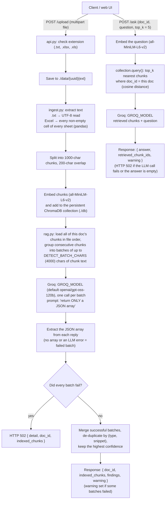

# RiskBot – HRCI / NPPI Detector

[](https://github.com/Kadaru242003/HRCI-NPPI-doc-finder/actions/workflows/tests.yml)

RiskBot is a small FastAPI service that uses an LLM served by [Groq](https://groq.com) (`openai/gpt-oss-120b` by default, configurable with `GROQ_MODEL`) to flag
sensitive data in uploaded **.txt** and **Excel** files:

- **HRCI**: Human Resources Confidential Information, such as salaries, bonuses, performance reviews, PIPs,
  terminations and employment-related medical information.
- **NPPI**: Non-Public Personal Information, such as SSN-like numbers, bank or routing numbers, account or
  loan numbers and credit card numbers.

You upload a file and get back a JSON list of flagged text spans found anywhere in the file. A chat endpoint
then answers follow-up questions about the same document, such as "show only NPPI". It retrieves the chunks of
the document most similar to the question and gives only those to the LLM (retrieval-augmented generation).
A single-page web UI is included.

<p align="center">
  
  <br/><br/>
  
</p>

---

## How it works

The LLM does all of the detection. There are no regex rules or trained classifiers.



### How ChromaDB and the embedding model are used

`store.py` owns a single `chromadb.PersistentClient` and the `all-MiniLM-L6-v2` embedder, and ingest and rag
both use them.

The embedder is ChromaDB's bundled ONNX build of `sentence-transformers/all-MiniLM-L6-v2`
(`chromadb.utils.embedding_functions.ONNXMiniLM_L6_V2`). It runs on ONNX Runtime, so **PyTorch and
sentence-transformers aren't installed**. It applies the same steps as sentence-transformers: the model's
tokenizer, truncation at 256 tokens, attention-masked mean pooling and L2 normalization, giving 384-dimension
vectors.

- The embedder is created **lazily, once per process**, on the first upload or question. Importing the app
  and starting the server don't load it.
- On first use, it downloads the model (an 80 MB archive, checked against a SHA-256 hash) from ChromaDB's
  model host to `~/.cache/chroma/onnx_models/`. Later starts reuse that copy.
- Texts are embedded one at a time (`EMBED_BATCH_SIZE = 1`). Every input is padded to 256 tokens, so larger
  batches cost a lot of extra memory and, on CPU, aren't faster. See [Memory](#memory).

The collection (`documents`) uses cosine distance and holds two kinds of records, told apart by the `kind`
metadata field: The collection (`documents`) uses cosine distance and holds two kinds of records, told apart by
the `kind` metadata field:

| Record | id | Metadata | Used by |
| --- | --- | --- | --- |
| Content chunk | `{doc_id}_{chunk_index}` | `doc_id`, `kind: "chunk"`, `chunk_index`, `file_name` | detection (read in file order) and `/ask` (similarity search) |
| Findings | `{doc_id}_findings` | `doc_id`, `kind: "findings"` | stored after detection; never returned by retrieval |

- **Retrieval (`/ask`)**: the question is embedded with the same model, and `collection.query()` returns the
  `top_k` nearest chunks filtered with `where = {doc_id: <doc>, kind: "chunk"}`. Chunks from other documents and
  findings records are never retrieved. Only the retrieved chunks are put in the prompt, most similar first, and
  their ids are returned as `retrieved_chunk_ids`.
- **Detection (`/upload`)** doesn't use similarity search. It is meant to scan the *whole* file, so it reads
  every chunk of the document by metadata filter, in `chunk_index` order.
- **Persistence**: data is written to `./db` (override it with `CHROMA_DIR`), so indexed documents and their
  findings survive a server restart.

### Project layout

```
api.py              FastAPI app: GET /, POST /upload, POST /ask, serves static/
store.py            Persistent Chroma client/collection and the lazily loaded ONNX embedder
ingest.py           Text extraction (txt / Excel), chunking, embedding, storing in Chroma
rag.py              Retrieval, batched detection + de-duplication, Groq calls, JSON recovery parser
static/index.html   Single-page UI (upload, findings table, chat box)
tests/              pytest suite; Groq and the embedding model are mocked
scripts/            measure_memory.py: peak RSS of a real server for one upload
```

---

## Setup

Requires **Python 3.10** (see `runtime.txt`) and a Groq API key.

```bash
git clone https://github.com/Kadaru242003/HRCI-NPPI-doc-finder.git
cd HRCI-NPPI-doc-finder

python3.10 -m venv venv
source venv/bin/activate
pip install -r requirements.txt
```

Nothing in `requirements.txt` pulls in PyTorch or a GPU build. Embeddings run on CPU with `onnxruntime`.

Create a `.env` file from the example:

```bash
cp .env.example .env
```

```dotenv
# .env
GROQ_API_KEY=your_groq_api_key_here
# GROQ_MODEL=openai/gpt-oss-120b
```

Optional settings, also read from the environment:

| Variable | Default | Meaning |
| --- | --- | --- |
| `GROQ_MODEL` | `openai/gpt-oss-120b` | Groq model for both detection and `/ask`. Empty means the default |
| `CHROMA_DIR` | `./db` | Where the Chroma database is stored |
| `RAG_TOP_K` | `5` | Chunks `/ask` retrieves when the request has no `top_k` |
| `DETECT_BATCH_CHARS` | `4000` | Max characters of chunk text per detection LLM call |

The app reads `GROQ_API_KEY` from the environment and **refuses to start without it**. The code doesn't load
`.env` itself, so either pass it to uvicorn with `--env-file`, as shown below, or `export GROQ_API_KEY=...` in
your shell. `.env` is git-ignored.

## Running

```bash
uvicorn api:app --env-file .env --reload
```

Run this from the repository root, because the `static/` directory is resolved relative to the working
directory. The first upload or question after a fresh install downloads the embedding model (80 MB) to
`~/.cache/chroma`, so it takes a few seconds longer.

- Web UI: <http://localhost:8000/static/index.html>
- Interactive API docs (FastAPI): <http://localhost:8000/docs>

## API

### `POST /upload`

Multipart form with one field, `file`. Allowed extensions: `.txt`, `.xlsx`, `.xls` (case-insensitive).

`sample.txt` (synthetic data):

```text
Employee: Jane Doe
Salary: $102,000
SSN: 123-45-6789
Notes: placed on a performance improvement plan.
```

```bash
curl -F "file=@sample.txt" http://localhost:8000/upload
```

Example response (the `findings` come from the LLM, so exact items and confidences vary from run to run):

```json
{
  "doc_id": "3f1c9a5e-8a1b-4a53-9c0e-2b6f7d1e4a90",
  "indexed_chunks": 1,
  "warning": null,
  "findings": [
    { "type": "HRCI", "text_snippet": "Salary: $102,000", "category": "salary", "confidence": 0.95 },
    { "type": "NPPI", "text_snippet": "123-45-6789", "category": "SSN", "confidence": 0.98 },
    { "type": "HRCI", "text_snippet": "placed on a performance improvement plan", "category": "performance", "confidence": 0.9 }
  ]
}
```

`warning` is `null` when every part of the file was scanned (see the errors table below). Each finding has the
shape the prompt asks the model for: `type` (`"HRCI"` or `"NPPI"`), `text_snippet`,
`category` and `confidence` (0.0–1.0). The server doesn't validate or filter these fields, and the prompt
explicitly asks the model to include low-confidence items.

Long files are scanned in full. Consecutive chunks are grouped into batches of at most `DETECT_BATCH_CHARS`
characters (a single chunk is never split), and the LLM is called once per batch. Because chunks overlap, the
same span can be reported by more than one batch. Findings are therefore merged and de-duplicated by `type` plus
`text_snippet` (case-insensitive, whitespace-normalized), keeping the entry with the highest `confidence` in
first-seen order. Items that aren't objects with a string `text_snippet` are de-duplicated only by exact value.

Errors:

| Case | Result |
| --- | --- |
| Extension not `.txt` / `.xlsx` / `.xls` | `400` `{"detail": "Unsupported file type. Allowed: .txt, .xlsx, .xls"}` |
| Excel file that can't be opened | `400` `{"detail": "Unable to open Excel file: ..."}` |
| Empty file | `200` with `indexed_chunks: 0`, `findings: []` and `warning: null` (the LLM isn't called) |
| The LLM finds nothing (replies `[]`) | `200` with `findings: []` and `warning: null`: a clean result |
| **Every** detection batch fails (LLM error such as a retired model, an empty reply, or a reply with no JSON array) | `502` with `detail` explaining that the file was NOT scanned, plus `doc_id` and `indexed_chunks`. No `findings` key, and no findings record is stored |
| **Some** batches fail | `200` with the findings from the batches that worked and a `warning` saying how many parts of the file weren't scanned and why |

A failed batch is never treated as "no findings". The error message names the model and the reason, for example:

```json
{
  "detail": "LLM detection failed for every part of the file (1 of 1), so the file was NOT scanned. Model 'openai/gpt-oss-120b', batch 1/1: HTTP 404: The model `openai/gpt-oss-120b` does not exist or you do not have access to it.",
  "doc_id": "3f1c9a5e-8a1b-4a53-9c0e-2b6f7d1e4a90",
  "indexed_chunks": 1
}
```

If you see a `does not exist` error, Groq has retired or renamed the model. Set `GROQ_MODEL` to a current model
from Groq's model list and restart. The web UI shows the error in red, clears the findings table so an old
result can't be mistaken for this file, and shows any `warning` in amber above the results.

#### Parsing the model's reply

The prompt asks for only a JSON array, and `[]` when nothing matches. `openai/gpt-oss-120b` is a reasoning
model, so the parser (`rag.extract_json_array`) accepts:

- a bare array,
- an array in ```` ```json ```` fences,
- an array with prose before or after it, even if that prose contains brackets,
- a reply that includes a `<think>…</think>` reasoning block, whose contents are ignored.

When several arrays appear, it uses the last one whose items are all objects. A reply with no array counts as a
failed batch, not as "no findings".

### `POST /ask`

Form fields:

| Field | Required | Meaning |
| --- | --- | --- |
| `doc_id` | yes | From `/upload` |
| `question` | yes | Free-text question or instruction |
| `top_k` | no | Number of chunks to retrieve, 1–50 (default `RAG_TOP_K`, which is 5). Other values return `422` |

The question is embedded, and the `top_k` most similar chunks of that document are sent to the LLM with the
question (fewer if the document has fewer chunks). The prompt includes guidance for "show only HRCI", "show only
NPPI", "show only salary" and "summarize".

```bash
curl -F "doc_id=3f1c9a5e-8a1b-4a53-9c0e-2b6f7d1e4a90" -F "question=show only NPPI" http://localhost:8000/ask
```

```json
{
  "answer": "- **123-45-6789** (SSN-like number, NPPI)",
  "retrieved_chunk_ids": ["3f1c9a5e-8a1b-4a53-9c0e-2b6f7d1e4a90_0"],
  "warning": null
}
```

If no chunks exist for `doc_id`, the response is `{"answer": "No document found.", "retrieved_chunk_ids": [],
"warning": null}` and the LLM isn't called. The answer is free text from the model, not structured JSON.

| Case | Result |
| --- | --- |
| LLM call fails (for example, a retired model) | `502` with `detail` naming the model and the reason, plus `retrieved_chunk_ids` |
| LLM returns an empty answer | `502` with `detail` |
| Answer cut off at the model's output token limit (`finish_reason: "length"`) | `200` with the partial `answer` and a `warning` |

### `GET /`

A minimal HTML page with a link to the UI.

---

## Tests

The test suite mocks the Groq client and the embedding model, and blocks network sockets, so it needs no
API key, no network access and no model download. The fake embedder is a deterministic bag-of-words vector, so texts that share words
are close, which makes retrieval results predictable. ChromaDB runs for real, as a persistent store in a temporary
directory for each test.

```bash
pip install -r requirements-dev.txt
pytest
```

The tests cover:

- `tests/test_parser.py`: the JSON recovery parser (clean JSON, JSON inside markdown fences, JSON surrounded
  by prose, broken JSON, non-array JSON). It also covers reasoning-model output: `<think>` blocks, brackets in the
  prose before or after the answer, an earlier format example, channel markers, and telling `[]` apart from
  "no array".
- `tests/test_llm_errors.py`: `GROQ_MODEL` (default, empty, custom, used by both endpoints). Also failures that
  use the Groq SDK's real `NotFoundError` for a retired model:
  - every batch failing returns `502` and stores no findings record,
  - some batches failing returns findings plus a `warning`,
  - `/ask` returns `502` for an LLM error or empty answer, and a `warning` for a cut-off answer.
- `tests/test_api.py`: `/upload` for `.txt` and `.xlsx` (including multi-sheet and header rows), unsupported and
  corrupt files, LLM failures and unparseable replies, `/ask` (answers, per-document scoping, unknown `doc_id`,
  missing fields) and serving the UI.
- `tests/test_rag.py`:
  - Retrieval returns the most similar chunks, only from the requested document, never the findings record.
  - `top_k` defaults to 5 and is validated.
  - Data survives a client restart and can be read from disk by a separate Python process.
  - Text past 4,000 characters is detected, and every chunk reaches detection.
  - A span in a chunk overlap is reported once, and one failed batch doesn't drop the others.
  - The batching and merge helpers work.
- `tests/test_store.py`: the embedder is created lazily and only once, texts are embedded in batches of
  `EMBED_BATCH_SIZE` in order, and neither `torch` nor `sentence_transformers` is imported.

GitHub Actions (`.github/workflows/tests.yml`) runs on every push and pull request. It:

1. installs `requirements-dev.txt` and checks that PyTorch, sentence-transformers and transformers aren't
   installed,
2. runs the test suite,
3. runs `scripts/measure_memory.py` with the real embedding model and fails if peak memory exceeds 350 MB.

---

## Memory

`scripts/measure_memory.py` starts the real server (`uvicorn api:app`, one worker) and uploads a
10,000-character `.txt` file, then sends one `/ask` request. After each step it reads the process's peak
resident memory (`VmHWM`). The embedding model is real. The Groq client is pointed at a tiny fake
chat-completions server started by the script, which answers `[]` and a short text. So both requests take their
normal success path, and no LLM request leaves the machine.

```bash
python scripts/measure_memory.py              # default: 10,000 characters, limit 350 MB
python scripts/measure_memory.py --chars 100000
```

Measured on Linux with Python 3.10:

| Step | Peak RSS |
| --- | --- |
| Server started (no model loaded yet) | 138 MB |
| + upload of a 10,000-character file (13 chunks; includes downloading the model on the first run) | 287 MB |
| + one `/ask` | 287 MB |
| Same, with a 100,000-character file (125 chunks) | 286 MB |

Peak memory doesn't grow with file size, because chunks are embedded one at a time. For comparison:

- Importing the previous stack's libraries (PyTorch and sentence-transformers from PyPI, plus chromadb, pandas,
  fastapi and groq) reached **653 MB** before any model was loaded. That is more than a 512 MB instance has.
- Embedding the 13 chunks in one batch of 32 (ChromaDB's default) instead of one at a time raised the peak to
  about 385 MB.

---

## Limitations

These describe what the code does today.

- **Detection cost grows with file size.** One LLM call is made per batch of about 4,000 characters, one after
  another, during the upload request. A large file means many calls, a slow response and possible Groq rate
  limits.
- **`/ask` only sees the retrieved chunks.** Answers are based on the `top_k` chunks most similar to the
  question. Requests that need the whole document, such as "summarize" or "list every SSN", only cover those
  chunks. The `/ask` endpoint doesn't use the stored findings.
- **Similarity isn't a relevance guarantee.** MiniLM embeddings capture topical similarity. A query like "show only
  NPPI" may not rank the chunk holding a bare account number highest.
- **Detection is entirely LLM-based and not deterministic.** Findings can miss items, include false positives,
  or vary between runs. Nothing validates the findings against the source text, and there is no confidence
  threshold.
- **Partial scans are possible.** If some detection batches fail, `/upload` still returns `200` with the other
  batches' findings. Check `warning`: it says how many parts weren't scanned. Failed batches aren't retried.
- **The default model can be retired.** Groq retires models. When that happens, uploads return `502` and `/ask`
  returns `502` until `GROQ_MODEL` is set to a current model. The prompt and parser are tested against mocked
  replies only, not against the live model.
- **Document text is sent to a third-party API.** Uploaded content leaves your machine and goes to Groq. Use only
  synthetic or approved data.
- **Nothing is ever deleted.** Chunks, findings (`./db`), uploaded files and their extracted-text copies
  (`./data/`) stay on disk indefinitely, and there is no delete endpoint. They hold the sensitive data the tool is
  meant to flag, unencrypted.
- **Sensitive data is written to logs.** The server prints the raw model output, the full findings and the first
  500 characters of extracted Excel text to stdout.
- **Excel extraction ignores structure.** Every non-empty cell is flattened into one value per line, row by row. Column
  headers are included as text, but the link between a header and its values is lost. Formulas are read as
  their stored values.
- **No authentication, upload size limit or rate limiting.** The whole upload is read into memory. Any client
  that knows a `doc_id` can query that document through `/ask`.
- **The first request after a fresh deploy is slower.** On hosts with an ephemeral filesystem, the 80 MB
  embedding model is downloaded again by the first upload or question after each restart.
- **Single process only.** Chroma's embedded `PersistentClient` isn't designed for several processes writing to
  the same directory, so run a single uvicorn worker.
