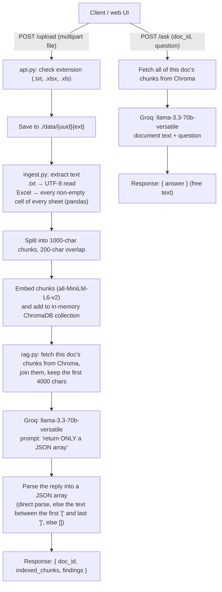

# RiskBot – HRCI / NPPI Detector

[](https://github.com/Kadaru242003/HRCI-NPPI-doc-finder/actions/workflows/tests.yml)

RiskBot is a small FastAPI service that uses an LLM (LLaMA-3.3-70B, served by [Groq](https://groq.com)) to flag
sensitive data in uploaded **.txt** and **Excel** files:

- **HRCI**: Human Resources Confidential Information, such as salaries, bonuses, performance reviews, PIPs,
  terminations and employment-related medical information.
- **NPPI**: Non-Public Personal Information, such as SSN-like numbers, bank or routing numbers, account or
  loan numbers and credit card numbers.

You upload a file and get back a JSON list of flagged text spans. A chat endpoint then lets you ask follow-up
questions about the same document, such as "show only NPPI" or "summarize". A single-page web UI is included.

<p align="center">
  
  <br/><br/>
  
</p>

---

## How it works

The LLM does all of the detection. There are no regex rules or trained classifiers.



### What ChromaDB and Sentence Transformers are actually used for

Each chunk is embedded with `all-MiniLM-L6-v2` and stored in ChromaDB with its `doc_id`. **The embeddings
are never queried, though**: there is no similarity search. Both endpoints pull *every* stored chunk for the
given `doc_id` (a metadata filter applied in Python) and send that text to the LLM. Chroma works here as an
in-process document store keyed by `doc_id`. It is not a retrieval step, so this is not retrieval-augmented
generation (RAG) in the usual sense.

The Chroma client is created in-memory (`chromadb.Client(Settings(persist_directory="./db"))`). In chromadb 0.4.x
that does **not** write to disk, so all indexed documents are lost when the server restarts.

### Project layout

```
api.py              FastAPI app: GET /, POST /upload, POST /ask, serves static/
ingest.py           Text extraction (txt / Excel), chunking, embedding, storing in Chroma
rag.py              Detection prompt, Groq call, JSON recovery parser, chunk lookup by doc_id
static/index.html   Single-page UI (upload, findings table, chat box)
tests/              pytest suite; Groq and the embedding model are mocked
```

---

## Setup

Requires **Python 3.10** (see `runtime.txt`) and a Groq API key.

```bash
git clone https://github.com/Kadaru242003/HRCI-NPPI-doc-finder.git
cd HRCI-NPPI-doc-finder

python3.10 -m venv venv
source venv/bin/activate
pip install -r requirements.txt
```

`requirements.txt` pulls in PyTorch through `sentence-transformers`. To skip the large CUDA build on a machine
without a GPU, first run `pip install torch torchvision --index-url https://download.pytorch.org/whl/cpu`.

Create a `.env` file from the example:

```bash
cp .env.example .env
```

```dotenv
# .env
GROQ_API_KEY=your_groq_api_key_here
```

The app reads `GROQ_API_KEY` from the environment and **refuses to start without it**. The code doesn't load
`.env` itself, so either pass it to uvicorn with `--env-file`, as shown below, or `export GROQ_API_KEY=...` in
your shell. `.env` is git-ignored.

## Running

```bash
uvicorn api:app --env-file .env --reload
```

Run this from the repository root, because the `static/` directory is resolved relative to the working
directory. On first start, Sentence Transformers downloads `all-MiniLM-L6-v2` (about 90 MB) from the Hugging Face Hub.

- Web UI: <http://localhost:8000/static/index.html>
- Interactive API docs (FastAPI): <http://localhost:8000/docs>

## API

### `POST /upload`

Multipart form with one field, `file`. Allowed extensions: `.txt`, `.xlsx`, `.xls` (case-insensitive).

`sample.txt` (synthetic data):

```text
Employee: Jane Doe
Salary: $102,000
SSN: 123-45-6789
Notes: placed on a performance improvement plan.
```

```bash
curl -F "file=@sample.txt" http://localhost:8000/upload
```

Example response (the `findings` come from the LLM, so exact items and confidences vary from run to run):

```json
{
  "doc_id": "3f1c9a5e-8a1b-4a53-9c0e-2b6f7d1e4a90",
  "indexed_chunks": 1,
  "findings": [
    { "type": "HRCI", "text_snippet": "Salary: $102,000", "category": "salary", "confidence": 0.95 },
    { "type": "NPPI", "text_snippet": "123-45-6789", "category": "SSN", "confidence": 0.98 },
    { "type": "HRCI", "text_snippet": "placed on a performance improvement plan", "category": "performance", "confidence": 0.9 }
  ]
}
```

Each finding has the shape the prompt asks the model for: `type` (`"HRCI"` or `"NPPI"`), `text_snippet`,
`category` and `confidence` (0.0–1.0). The server doesn't validate or filter these fields, and the prompt
explicitly asks the model to include low-confidence items.

Errors:

| Case | Result |
| --- | --- |
| Extension not `.txt` / `.xlsx` / `.xls` | `400` `{"detail": "Unsupported file type. Allowed: .txt, .xlsx, .xls"}` |
| Excel file that can't be opened | `400` `{"detail": "Unable to open Excel file: ..."}` |
| Empty file | `200` with `indexed_chunks: 0` and `findings: []` (the LLM isn't called) |
| LLM call fails, or its reply has no parseable JSON array | `200` with `findings: []` (the error goes to the server log) |

### `POST /ask`

Form fields `doc_id` (from `/upload`) and `question`. The prompt includes guidance for "show only HRCI", "show only
NPPI", "show only salary" and "summarize". Any other question is passed to the model as-is.

```bash
curl -F "doc_id=3f1c9a5e-8a1b-4a53-9c0e-2b6f7d1e4a90" -F "question=show only NPPI" http://localhost:8000/ask
```

```json
{ "answer": "- **123-45-6789** (SSN-like number, NPPI)" }
```

If no chunks exist for `doc_id`, the response is `{"answer": "No document found."}` and the LLM isn't called.
The answer is free text from the model, not structured JSON.

### `GET /`

A minimal HTML page with a link to the UI.

---

## Tests

The test suite mocks the Groq client and the Sentence Transformers model, and blocks network sockets, so it needs no
API key and no network access. ChromaDB runs for real, in memory.

```bash
pip install -r requirements-dev.txt
pytest
```

The tests cover:

- `tests/test_parser.py`: the JSON recovery parser (clean JSON, JSON inside markdown fences, JSON surrounded
  by prose, broken JSON, non-array JSON).
- `tests/test_api.py`: `/upload` for `.txt` and `.xlsx` (including multi-sheet and header rows), unsupported and
  corrupt files, LLM failures and unparseable replies, the 4000-character limit, `/ask` (answers, per-document
  scoping, unknown `doc_id`, missing fields) and serving the UI.

GitHub Actions (`.github/workflows/tests.yml`) runs the suite on every push and pull request.

---

## Limitations

These describe what the code does today.

- **Only the first 4,000 characters are analyzed.** Detection joins the document's chunks and cuts the result to
  4,000 characters before calling the LLM. Anything later in a longer file isn't checked. Because chunks
  overlap by 200 characters, the joined text also repeats those overlaps, so the unique text analyzed is a
  little under 4,000 characters.
- **`/ask` sends the whole document** with no length limit, so very large files can exceed the model's context
  window. A Groq error on `/ask` returns HTTP 500.
- **Detection is entirely LLM-based and not deterministic.** Findings can miss items, include false positives,
  or vary between runs. Nothing validates the findings against the source text, and there is no confidence
  threshold.
- **A failure looks like a clean result.** If the Groq call fails or the reply can't be parsed, `/upload`
  still returns `200` with `findings: []`.
- **Document text is sent to a third-party API.** Uploaded content leaves your machine and goes to Groq. Use only
  synthetic or approved data.
- **No vector retrieval.** Embeddings are computed and stored but never searched (see above).
- **Storage isn't persistent, and nothing is cleaned up.** ChromaDB is in-memory, so documents disappear on
  restart. The uploaded files in `./data/` and their extracted-text copies (`<file>.txt`) stay on disk
  indefinitely.
- **Sensitive data is written to logs.** The server prints the raw model output, the full findings and the first
  500 characters of extracted Excel text to stdout.
- **Excel extraction ignores structure.** Every non-empty cell is flattened into one value per line, row by row. Column
  headers are included as text, but the link between a header and its values is lost. Formulas are read as
  their stored values.
- **No authentication, upload size limit or rate limiting.** The whole upload is read into memory. Any client
  that knows a `doc_id` can query that document through `/ask`.
- **Single process only.** Documents live in that process's memory, so running several uvicorn workers would
  split them across processes.
